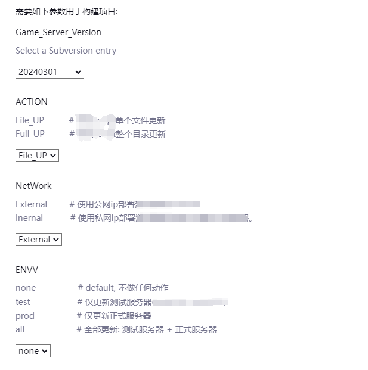
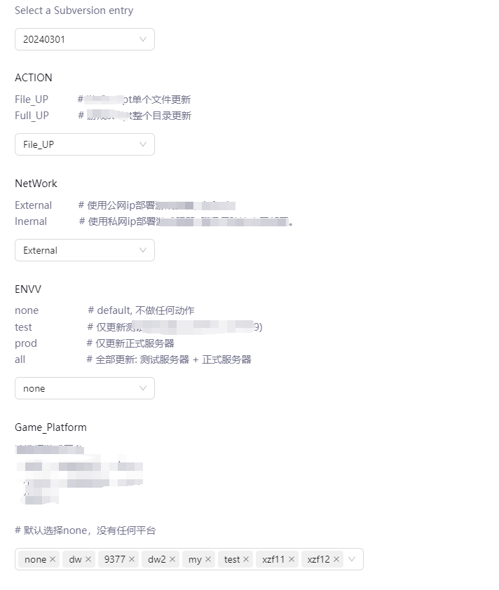
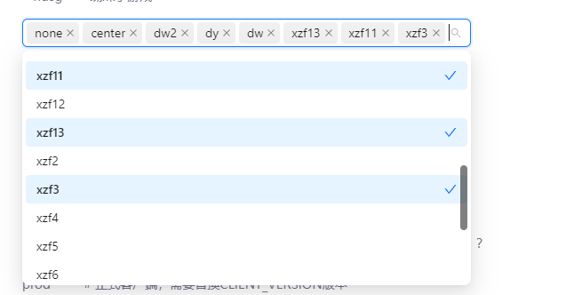
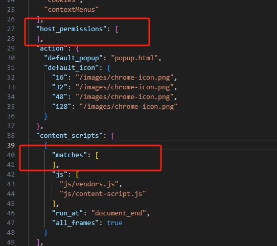

# Jenkins选项参数组件美化插件
Jenkins选项参数组件美化插件。优化Jenkins选项参数的样式和搜索。


jenkins原有的选项参数。



美化后的样式。




## 特性
1. 美化了选项参数样式.
2. 每个选项参数都支持搜索.
3. 支持搜索多选.

## 开发
### Linux / Mac OS
```bash
npm install
npm run start
```

### 支持的环境变量（.env）
```env
NODE_ENV=development
EXTENSION_NAME=Jenkins Select beautify extension
EXTENSION_DESCRIPTION=A chrome extension that beautify jenkins select elements
# jenkins地址，多个以道号分隔
HOST_PERMISSIONS=https://jenkins.example.net/*,https://jenkins2.example.net/*
```

### 安装开发包
1. 打开 Chrome 浏览器。
2. 在地址栏输入 chrome://extensions/ 并按下 Enter 键。
3. 在右上角启用「开发者模式」。
4. 点击「加载已解压的扩展程序」按钮，选择```extension```插件文件夹。

## 安装

1. 下载插件文件（.zip 文件）。
2. 解压zip文件，修改```manifest.json```。配置```host_permissions```和```content_scripts[0].matches```，填入jenkins域名，如：```https://jenkins.example.com/*```

2. 打开 Chrome 浏览器。
3. 在地址栏输入 chrome://extensions/ 并按下 Enter 键。
4. 在右上角启用「开发者模式」。
5. 点击「加载已解压的扩展程序」按钮，选择下载的插件文件夹。
6. 插件将被安装并显示在扩展程序列表中。